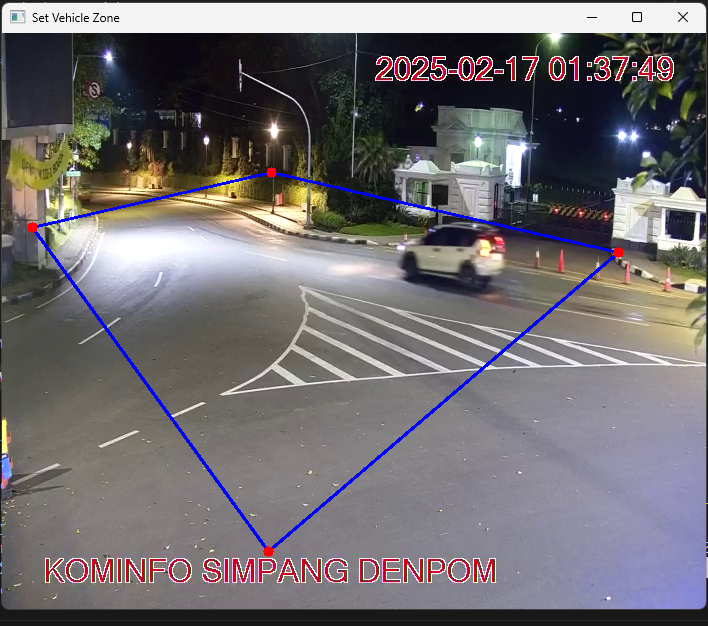

# Vehicle Detection, Tracking, and Counting System

This project implements a vehicle detection, tracking, and counting system to monitor areas using livestreaming CCTV. the system utilizes yolov10s for vehicle detection and tracks vehicles within defined polygons to count their entries and exits.

## Setup

### Prerequisites

make sure your tools match this version to ensure smooth running

1. **Python** : version 3.11.9
2. **Pip** : version 25.0.1
3. **Docker** (optional) : version 27.5.1

### Run Project

you can use docker or your local setup to run this project, first clone this github repo

```bash
git clone https://github.com/ilhamakbardev/synapsis-challenge-ai-engineer.git

cd synapsis-challenge-ai-engineer/
```

#### If you prefer to use docker

1. build docker:

   ```bash
   docker-compose build --no-cache
   ```

2. run docker:

   ```bash
   docker-compose up -d
   ```

   make sure that docker is run before continue to next step

3. run vehicle-counter:

   ```bash
   cd vehicle-counter/

   py -m venv .venv #create virtual env

   source .venv/Scripts/activate #use virtual env

   pip install -r requirements.txt

   py vehicle-counter-zone.py
   ```

   above command use CCTV [Bogor Single Windows](https://bsw.kotabogor.go.id/cctv/59/detail) by default, if you want to use different CCTV endpoint, use args -i

   ```bash
   py vehicle-counter-zone.py -i "https://cctvjss.jogjakota.go.id/atcs/ATCS_Simpang_Demangan_View_Selatan.stream/playlist.m3u8"
   ```

4. input area name, then click enter:

   

5. set polygon area:

   after entering the area name, a python runtime app should appear in the bottom. click it.
   

   then draw polygon area : click left mouse to set coordinate, and then press q
   

6. just wait a moment, it start to run.
   

#### If you prefer to use local setup

just create venv and install requirements in each directory, you can adjust DB CONFIG on your own needs, make sure you run in order : api, vehicle-counter, and then dashboard

---

### Database Schema (ERD)


### System Design


### Detection and tracking method


- object detection: i am using the yolov10s model for object detection. This model is responsible for identifying vehicles (cars, motorcycles, buses, trucks) in each frame of the video and drawing bounding boxes around them.

- object tracking: yolov10s will assign a unique ID to each detected vehicle and try to maintain that ID across subsequent frames, even if the vehicle moves or is temporarily occluded. this is crucial for counting vehicles correctly

- polygon definition: The set_polygon() function allows the user to define the region of interest (ROI) by clicking on the video frame to create a polygon. nnly vehicles within this polygon will be counted.

- counting logic:

  - for each frame, the logic check if the center of the bounding box of each detected vehicle is inside the defined polygon using self.is_inside_polygon(center). if a vehicle's center is inside the polygon and it's not already in the inside set, you increment the entered count and add the vehicle's ID to the inside set.

  - if a vehicle is in the inside set but its center is no longer inside the polygon in the current frame, the logic is increment the exited count

  - display: The process_frame function draws bounding boxes around detected vehicles, displays their ID, and shows the counts of inside, entered, and exited vehicles on the frame.

### CCTV source

by default, livestreaming CCTV source is from [Bogor Single Windows](https://bsw.kotabogor.go.id/cctv/59/detail), but user can use other CCTV source, as state above

### API endpoints

- POST /api/areas/: create a new area
- POST /api/detections/: log (store) a vehicle detection
- GET /api/stats/: get vehicle count history. supports the following query parameters:
  - start_time (optional): start date/time for filtering
  - end_time (optional): end date/time for filtering
  - page (optional, default: 1): page number for results
  - size (optional, default: 10): number of results per page
- GET /api/stats/live: get live vehicle counts (entering/exiting)
- GET /api/forecast: get vehicle count forecast

### Feature completed checklist

1. Desain Database (Done)

2. Pengumpulan Dataset ([vehicles_counter_seed.sql](vehicles_counter_seed.sql) from dump logging in local DB as result of vehicle-counter-zone.py CCTV tracking)

   kendala : i fail seed it to docker postgreSQL

3. Object Detection & Tracking (Done)

   kendala : it fail to run on docker, must run in local

4. Counting & Polygon Area (Done)

   kendala : it fail to run on docker, must run in local

5. Prediksi (Forecasting) (Done, but if it has lower than 2 data, it generates error in forecasting)

   kendala : lack of data for forecasting because i fail to seed [vehicles_counter_seed.sql](vehicles_counter_seed.sql) to DB docker

6. Integrasi API (API/Front End) (Done, [dashboard.py](./dashboard/dashboard.py), but not all endpoint is implemented on dashboard)

7. Deployment (Done for api and dashboard (streamlit))

   kendala : deployment for vehicle-counter-zone.py is not success
